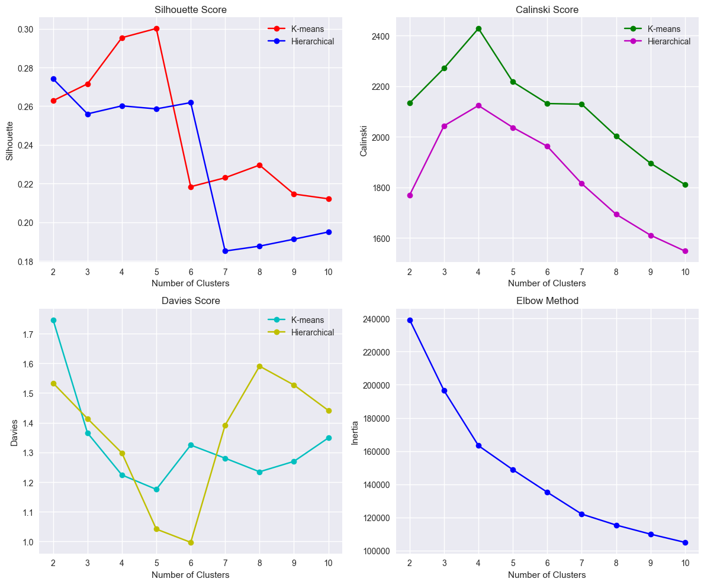
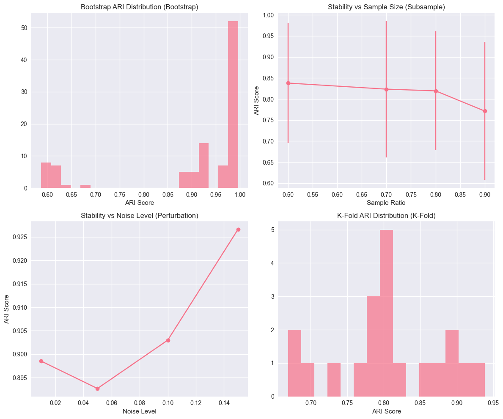
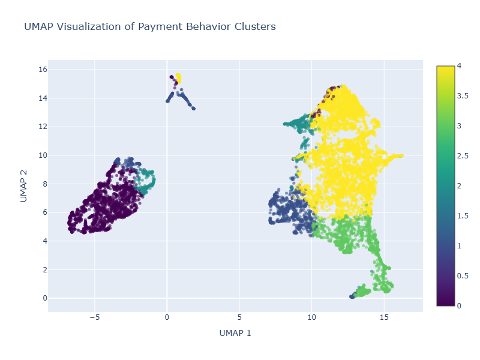
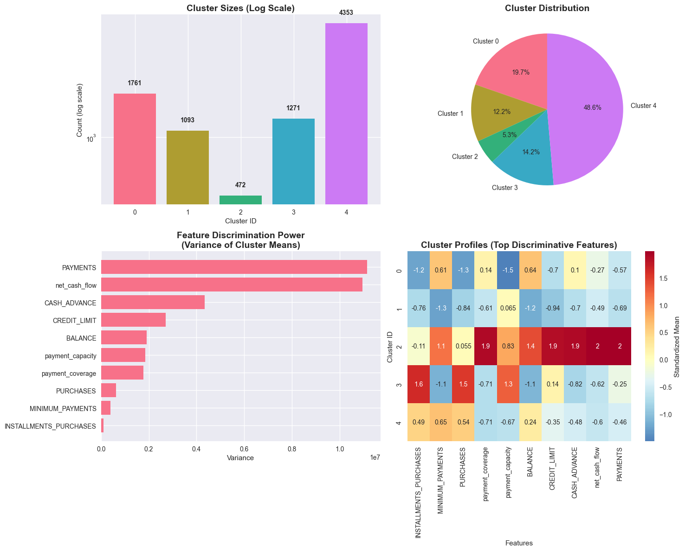

# 📳 Credit Card Customer Behavioral Segmentation


## 🎯 Project Overview & My Journey

As someone transitioning into data analytics, I chose this credit card customer segmentation project to demonstrate my ability to transform complex business data into actionable insights. This wasn't just about applying clustering algorithms—it was about discovering how sophisticated analytics can challenge traditional assumptions and unlock hidden value in financial data.

**What attracted me to this project:**
- **Real Business Problem**: Credit card companies need to understand diverse customer behaviors to optimize risk and revenue
- **Technical Challenge**: Unsupervised learning with complex, multi-dimensional behavioral data  
- **Strategic Impact**: Potential to identify millions in revenue opportunities through better customer classification

**What I aimed to demonstrate:**
- Advanced feature engineering for financial data
- Rigorous model validation and statistical testing
- Translation of technical findings into business strategy
- Professional-grade analysis documentation and presentation

This analysis reveals a critical insight: **payment behavior matters more than spending volume for risk assessment**—a finding that could reshape how financial institutions evaluate their customers.

## 📊 Dataset & Data Quality

**Source**: [Kaggle Market Segmentation Dataset](https://www.kaggle.com/datasets/jillanisofttech/market-segmentation-in-insurance-unsupervised)
- **Size**: 8,950 active credit cardholders, 18 behavioral variables
- **Coverage**: 6 months of comprehensive transaction data
- **Data Quality**: Complete dataset with no missing values (exceptional quality)

**Key Financial Metrics**:
- `BALANCE`: Outstanding credit card balance ($0 - $19,043)
- `PURCHASES`: Total purchase transactions ($0 - $49,040)
- `CASH_ADVANCE`: Cash advance usage patterns ($0 - $47,137)
- `PAYMENTS`: Payment behavior metrics ($0 - $50,721)
- `CREDIT_LIMIT`: Available credit capacity ($50 - $30,000)
- `PRC_FULL_PAYMENT`: Full payment percentage (0% - 100%)
- `TENURE`: Account relationship length (6-12 months)

## 🛠️ Technical Implementation

**Core Analytics Stack**
- `Python 3.9+` - Primary analysis environment
- `Pandas` & `NumPy` - Data manipulation and numerical computing
- `Scikit-learn` - Machine learning algorithms and preprocessing
- `Matplotlib` & `Seaborn` - Statistical visualizations

**Advanced ML Techniques**
- `K-means Clustering` - Primary segmentation algorithm with k=5 optimization
- `PCA`, `t-SNE`, `UMAP` - Dimensionality reduction and validation
- `Bootstrap Analysis` - Model stability assessment (82% consistency achieved)
- `Statistical Testing` - Feature significance validation (p < 0.001 for all discriminative features)

**Business Intelligence**
- `Power BI` - Interactive dashboard and business reporting
- `Plotly` - Advanced interactive visualizations

## 🔍 Methodology & Technical Approach

### 1. **Advanced Feature Engineering (38 features created)**
Starting with 18 raw variables, I engineered sophisticated behavioral indicators:

- **Payment Behavior Ratios**: `payment_to_balance_ratio`, `min_payment_ratio`, `spending_sustainability`
- **Credit Utilization Metrics**: `credit_utilization_ratio`, `effective_utilization`, `debt_to_limit`
- **Cash Flow Analysis**: `net_cash_flow`, `cash_advance_dependency`, `months_to_payoff`
- **Activity Patterns**: `total_activity`, `avg_purchase_size`, `financial_stress`
- **Composite Risk Scores**: `payment_risk_score`, `customer_value_score`

### 2. **Rigorous Feature Selection (32 final features)**
- **Variance Threshold Analysis**: Removed low-variance features (threshold: 0.01)
- **Correlation Matrix Optimization**: Eliminated highly correlated features (threshold: 0.9)
- **Statistical Result**: Preserved 32 discriminative features from original 38

### 3. **Data Preprocessing Pipeline**
- **Log Transformation**: Applied to right-skewed financial distributions to normalize extreme ranges
- **Robust Scaling**: Used RobustScaler for outlier resilience while preserving business-critical patterns
- **Outlier Strategy**: Retained all data points to preserve legitimate high-value customer patterns

### 4. **Clustering Implementation & Validation**
- **Algorithm Selection**: K-means with comprehensive metric evaluation (Silhouette, Calinski-Harabasz, Davies-Bouldin, Elbow)
- **Optimal K=5**: Determined through multi-metric consensus and business interpretability

- **Validation Framework**: 
  - Bootstrap analysis: 82% model stability across samples
  - Noise resilience: Stable performance with up to 14% data perturbation
  - Cross-validation: ARI scores consistently 0.80-0.85
  - Statistical significance: All features p < 0.001


### 5. **Multi-Perspective Visualization**
- **PCA**: 49.7% variance explained in 2 components (moderate separation)
- **t-SNE**: Excellent cluster boundaries with minimal overlap
- **UMAP**: Superior cluster definition, used for final validation


*UMAP visualization showing clear separation between five distinct customer segments. Each color represents a different behavioral cluster with minimal overlap, validating the strength of our segmentation approach.*

## 🎯 Key Findings & Customer Segments

### **5 Distinct Customer Behavioral Profiles**


| Segment | Size | Profile | Payment Discipline | Risk Level |
|---------|------|---------|-------------------|------------|
| **💸 Emergency Borrowers** | 19.7% | Cash advance dependent | Poor (30% above minimum) | 🚨 High Risk (78.7 score) |
| **🛡️ Conservative Users** | 12.2% | Low-activity, stable | Moderate (60% above minimum) | ✅ Low Risk (46.2 score) |
| **💰 Hidden Gems** | 5.3% | **High-volume sophisticated managers** | **Excellent (90% above minimum)** | ✅ **Lower Risk** |
| **🏆 Premium Transactors** | 14.2% | High-value, low-risk customers | Premium (40% full + 50% above minimum) | ✅ Lowest Risk (11.9 score) |
| **🏦 Persistent Revolvers** | 48.6% | Mainstream debt carriers | Struggling (35% minimum only) | ⚠️ Medium Risk (57.7 score) |

### **Critical Strategic Discovery**

**⚡ Payment Behavior > Usage Volume for Risk Assessment**

The analysis revealed a fundamental flaw in traditional risk models:
- **Hidden Gem Segment** (5.3% of customers): Uses $5,102 in cash advances but maintains **90% above-minimum payment rate**
- Traditional models would classify these as high-risk due to usage volume
- Reality: They demonstrate the **best payment discipline** in the entire portfolio
- **Business Impact**: These customers represent premium growth opportunities, not risks

### **Behavioral Hierarchy Discovery**
Payment discipline creates clear customer value tiers:
- **Premium**: 90% above minimum (Clusters 2 & 3)
- **Stable**: 60-65% above minimum (Clusters 1 & 4) 
- **High Risk**: 30% above minimum (Cluster 0)

## 📈 Business Impact & Strategic Recommendations

### **Segment-Specific Action Plans**

**💸 Emergency Borrowers (19.7% - High Priority)**
- **Risk Profile**: 99.9% cash advance dependency, 30% above-minimum payments
- **Action**: Immediate credit limit restrictions, mandatory financial counseling
- **Goal**: Prevent defaults and debt spiral progression

**🛡️ Conservative Users (12.2% - Growth Opportunity)**
- **Profile**: Stable customers with 3.3% utilization, underutilized capacity
- **Action**: Targeted activation campaigns, reward programs, limit increases
- **Goal**: Convert stable users to active revenue generators

**💰 Hidden Gems (5.3% - Premium Opportunity) ⭐**
- **Profile**: $665 average value with 90% above-minimum payment discipline
- **Action**: Credit expansion, premium rewards, relationship banking
- **Goal**: Capture increased volume from sophisticated debt managers

**🏆 Premium Transactors (14.2% - Retention Focus)**
- **Profile**: $802 average value, 4.5% utilization despite high spending
- **Action**: VIP treatment, premium cards, wealth management cross-sell
- **Goal**: Maintain highest-value, lowest-risk customers

**🏦 Persistent Revolvers (48.6% - Stabilization)**
- **Profile**: 97% always carry balance, payment assistance needed
- **Action**: Debt restructuring, payment education, behavioral nudges
- **Goal**: Prevent migration to high-risk segments

### **Portfolio Optimization Opportunities**

**Revenue Protection & Growth:**
- **Reclassification Impact**: Hidden Gems segment unlocks $665 average customer value potential
- **Premium Retention**: Protect $802 average value customers through VIP programs  
- **Risk Mitigation**: Proactive intervention for 19.7% high-risk customers

**Operational Improvements:**
- **Advanced Risk Models**: Weight payment behavior over utilization patterns
- **Targeted Marketing**: Segment-specific campaigns based on behavioral patterns
- **Preventive Interventions**: Early warning systems for segment migration

## ⚡ Technical Performance & Validation

**Processing Efficiency:**
- Complete pipeline execution: Under 5 minutes on standard hardware
- Memory optimization supports large-scale deployment
- Modular architecture enables production scaling

**Model Robustness:**
- **Stability**: 82% consistency across bootstrap validation samples
- **Noise Resilience**: Stable performance with up to 14% data perturbation  
- **Cross-validation**: ARI scores consistently within 0.80-0.85 range
- **Statistical Significance**: All discriminative features p < 0.001

**Production Readiness:**
- Efficient pandas/scikit-learn implementation
- Real-time scoring capability with minimal latency
- Extensible to multi-million customer datasets

## 🎯 What I Learned & Skills Demonstrated

**Technical Expertise Developed:**
- **Advanced Feature Engineering**: Created 38 behavioral indicators from 18 raw variables
- **Unsupervised ML Mastery**: Optimized K-means clustering with comprehensive validation
- **Statistical Rigor**: Bootstrap analysis, significance testing, and multi-metric evaluation

**Key Professional Insights:**
- **Domain Expertise Integration**: Financial data requires specialized preprocessing and interpretation
- **Business Translation**: Technical complexity must be distilled into actionable strategy
- **Model Validation Critical**: Multiple validation approaches essential for business confidence
- **Assumptions Challenge**: Data can reveal counterintuitive insights that challenge conventional wisdom

**Strategic Communication Skills:**
- Translated complex statistical findings into executive-level recommendations
- Created compelling visualizations that tell the data story
- Balanced technical rigor with business accessibility
- Developed presentation materials for both technical and business audiences

## ⚠️ Limitations & Future Enhancements

### **Current Analysis Limitations**

**Data Constraints:**
- **Temporal Scope**: 6-month snapshot limits seasonal pattern analysis
- **External Context**: No demographic, geographic, or economic indicator data
- **Account Lifecycle**: Limited insight beyond 6-12 month tenure range

**Business Application Gaps:**
- **Implementation Testing**: Requires pilot programs to validate real-world performance
- **Cross-Product Analysis**: Limited to credit card data; missing broader financial relationship context
- **Competitive Dynamics**: No insight into multi-card customer behavior or market positioning

### **Future Enhancement Roadmap**

**Advanced Analytics:**
- **Temporal Modeling**: Longitudinal customer journey tracking and lifecycle prediction
- **Predictive Framework**: Customer migration forecasting and churn prevention models
- **External Integration**: Economic indicators and demographic data enrichment
- **Real-time Processing**: Streaming analytics with dynamic re-segmentation

**Production Deployment:**
- **A/B Testing Framework**: Controlled experiments to validate segment strategies
- **Performance Monitoring**: Real-time KPIs and segment migration tracking
- **Integration Architecture**: CRM and marketing platform connectivity
- **Feedback Loops**: Continuous model refinement based on business outcomes

## 🚀 Quick Start

### Prerequisites
- Python 3.9 or higher
- 8GB+ RAM recommended for optimal performance
- Git for repository management

### Installation
1. **Clone the repository:**
   ```bash
   git clone https://github.com/yourusername/credit-card-segmentation.git
   cd credit-card-segmentation
   ```

2. **Create and activate virtual environment:**
   ```bash
   python -m venv .myenv
   source .myenv/bin/activate  # Windows: .myenv\\Scripts\\activate
   ```

3. **Install dependencies:**
   ```bash
   pip install -r requirements.txt
   ```

### Usage
1. **Launch Jupyter environment:**
   ```bash
   jupyter lab
   ```

2. **Run the complete analysis:**
   ```bash
   # Open and execute the main notebook
   credit_card_users_segmentation.ipynb
   ```

3. **View interactive dashboard:**
   - Open Power BI dashboard: [Live Dashboard Link](https://app.powerbi.com/view?r=eyJrIjoiYzNjNDBiZWItNDRkMS00NDQ3LWE3NmMtNGI2ZWRlMzA5YzVlIiwidCI6IjhjY2M5ZDBkLTA3YmMtNDZlNS05NDg3LTUzNWFiYWY4N2ViMSJ9)

## 📁 Project Structure
```
credit-card-segmentation/
├── dataset/
│   ├── Customer_Data.csv          # Raw credit card data
│   └── df_cleaned.csv            # Processed dataset
├── images/                       # Generated visualizations
├── utils/                       # Custom analysis modules
│   ├── cluster_visualizer.py    # Advanced visualization tools
│   └── cluster_validator.py     # Model validation framework
├── Viz/                         # Business intelligence assets
│   └── credit_card_user_behavior.pbix
├── credit_card_users_segmentation.ipynb  # Main analysis notebook
├── requirements.txt             # Python dependencies
├── .gitignore                   # Git ignore configuration
└── README.md                    # Project documentation
```

## 🎨 Interactive Visualizations

**Live Dashboard**: [Power BI Customer Segmentation Dashboard](https://app.powerbi.com/view?r=eyJrIjoiYzNjNDBiZWItNDRkMS00NDQ3LWE3NmMtNGI2ZWRlMzA5YzVlIiwidCI6IjhjY2M5ZDBkLTA3YmMtNDZlNS05NDg3LTUzNWFiYWY4N2ViMSJ9)

**Portfolio Presentation**: [Complete Analysis Results](portfolio_presentation.html)

## 🤝 Connect & Collaborate

I'm actively building my data analytics portfolio and seeking opportunities to apply these analytical skills to real-world business challenges. This project demonstrates my ability to tackle complex problems, derive actionable insights, and communicate findings effectively.

**Let's connect and discuss data analytics opportunities:**

- **LinkedIn**: [Your LinkedIn Profile](https://linkedin.com/in/yourprofile)
- **Email**: your.email@example.com  
- **GitHub**: [https://github.com/yourusername](https://github.com/yourusername)
- **Portfolio**: [Your Portfolio Website](https://yourportfolio.com)

**I'm particularly interested in:**
- Data Analytics roles in financial services
- Customer analytics and segmentation projects
- Machine learning applications in business strategy
- Mentorship opportunities in advanced analytics
